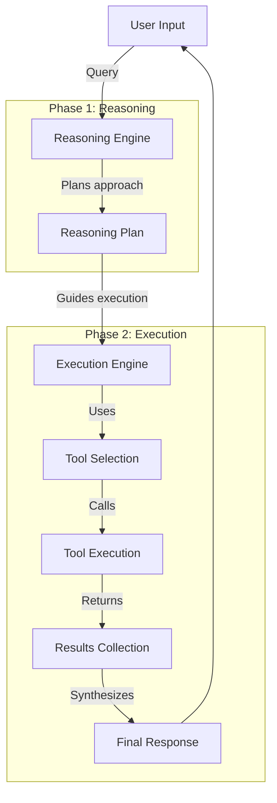
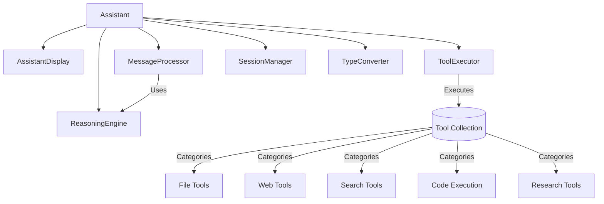
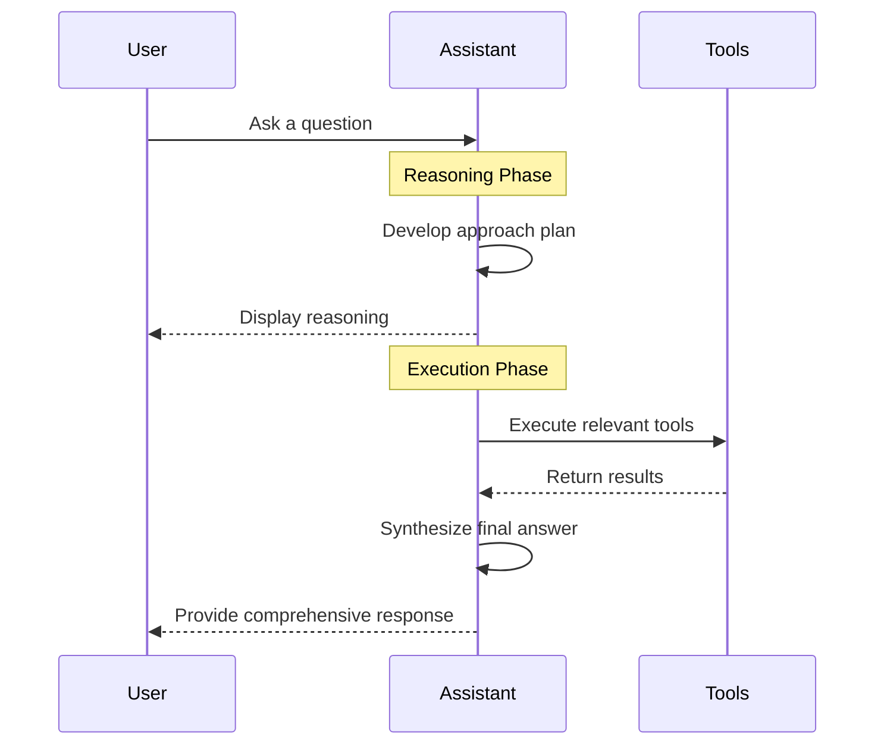

# Gem-assist-linux: Enhanced Terminal-based AI Assistant

<p align="center">
  
  
  
</p>

> **Important Note**: This is a significantly improved Linux fork of [Fus3n's gem-assist](https://github.com/Fus3n/gem-assist) with numerous enhancements, bug fixes, and new features to make it fully functional on Linux systems.

Gem-assist-linux is a powerful terminal-based AI assistant powered by Google's Gemini models. It employs a unique two-phase reasoning architecture along with an expanded toolset to provide intelligent assistance directly in your terminal.

## 🔄 Fork Improvements

This Linux fork provides substantial improvements over the original project:

- **Two-Phase Reasoning Architecture**: Added a completely new reasoning-before-execution approach
- **Enhanced Terminal UI**: Improved console interaction and display formatting
- **Extended Tool Set**: Added numerous new tools including arXiv research paper integration
- **YouTube Transcript Analysis**: Added capability to extract and analyze video content
- **Improved Web Content Extraction**: Better handling of complex websites and content extraction
- **Research Tools**: New tools for scholarly research and academic paper analysis
- **Linux Compatibility**: Fixed various issues that prevented proper functionality on Linux systems
- **Comprehensive System Information**: Enhanced system information collection and reporting

## 🌟 Key Features

- **Two-Phase Reasoning**: Planning before execution ensures thoughtful and strategic responses
- **Rich Tool Ecosystem**: 30+ specialized tools for file operations, web searches, code execution, and more
- **Research Capabilities**: Direct access to academic papers through arXiv integration
- **YouTube Analysis**: Extract and analyze video transcripts
- **Efficient Web Strategy**: Smart search tools to avoid rate limits while maximizing information quality
- **Local File Access**: Read and manipulate various file types including PDFs, Word documents, and Excel files
- **Customizable**: Easy configuration through a central config.py file

## 🏗️ Architecture

Gem-assist-linux uses a deliberate two-phase approach to solve problems:

1. **Reasoning Phase**: The assistant first analyzes the query and plans an approach
2. **Execution Phase**: The assistant follows the reasoning plan to execute tools and provide a final response

> **Note**: The architecture diagrams below will render properly on GitHub and GitLab. In other environments, you'll see the diagram code instead.



### Core Components

The assistant consists of several interconnected components that work together:

- **Assistant**: Central coordinator that manages the conversation
- **MessageProcessor**: Handles conversation flow and message processing
- **ReasoningEngine**: Plans approach without executing tools
- **ToolExecutor**: Executes tools according to the reasoning plan
- **SessionManager**: Manages conversation history and persistence
- **Tool Collection**: Library of 30+ specialized tools across categories



## 🚀 Getting Started

### Prerequisites

- Python 3.11 or higher
- [uv](https://docs.astral.sh/uv/getting-started/installation/) (for dependency management)
- Google Gemini API key ([get one here](https://aistudio.google.com/apikey))

### Installation

1. **Clone the repository**:
   ```bash
   git clone https://github.com/DragonL57/gem-assist-linux.git
   cd gem-assist-linux
   ```

2. **Install core dependencies**:
   ```bash
   uv pip install -e .
   ```

3. **Install optional dependencies** (based on your needs):
   ```bash
   # For all optional dependencies
   uv pip install -e ".[all]"
   
   # Or install specific feature groups
   uv pip install -e ".[data-analysis,web-scraping,dynamic-web,documents]"
   ```

4. **Configure API keys**:
   Create a `.env` file in the project root with your API keys:
   ```
   GEMINI_API_KEY=your_api_key_here
   REDDIT_ID=your_reddit_client_id  # Optional
   REDDIT_SECRET=your_reddit_client_secret  # Optional
   ```

## 📋 Usage

Run the main script to start the chat interface:

```bash
uv run main.py
```

You'll see a chat interface where you can interact with the assistant. The conversation follows this workflow:

1. You ask a question
2. The assistant develops an approach plan (Reasoning Phase)
3. The assistant displays its reasoning
4. The assistant executes relevant tools (Execution Phase)
5. The assistant synthesizes all information and provides a comprehensive response



### Commands

Type `/help` to see available commands. Some useful ones include:

- `/exit` or `/quit` - Exit the chat
- `/save [name]` - Save the current session
- `/load [name]` - Load a saved session
- `/reset` - Reset the current session
- `/reasoning` - Show the assistant's reasoning for the last response

## 🛠️ Tool Categories

Gem-assist-linux includes tools across several categories:

| Category | Tools | Description |
|----------|-------|-------------|
| **File System** | `list_dir`, `read_file_content`, `write_files`, etc. | Interact with local files and directories |
| **Web** | `get_website_text_content`, `smart_content_extraction`, `get_youtube_transcript` | Extract and process web content |
| **Search** | `web_search`, `reddit_search` | Find information online |
| **Document Processing** | `read_excel_file`, `read_pdf_text`, `convert_document` | Work with various document formats |
| **Code Execution** | `execute_python_code`, `analyze_pandas_dataframe` | Run Python code and analyze data |
| **Research** | `get_arxiv_paper`, `summarize_research_paper` | Access and analyze academic papers |
| **System** | `get_system_info`, `run_shell_command` | Interact with your operating system |

## ⚙️ Configuration

The main configuration file is `config.py`. Here are some key settings you can customize:

```python
# Model selection
MODEL = "gemini/gemini-2.0-flash"  # or other supported models

# Assistant name
NAME = "Gemini"  # Customize your assistant's name

# Model parameters
TEMPERATURE = 0.25
TOP_P = None
MAX_TOKENS = 8192  # Maximum supported by your model
SEED = None

# Debug mode (shows model reasoning)
DEBUG_MODE = False  # Set to True to see model reasoning
```

**Note**: Restart the application after making changes to `config.py`.

## 🧪 Testing

To run tests:

```bash
uv run pytest tests/
```

## 🔍 Workflows

Gem-assist-linux is designed for various workflows:

### Research Workflow
1. **Web search**: Find high-quality sources
2. **Extract content**: Get detailed information from sources
3. **Execute Python code**: Analyze and synthesize findings
4. **Final answer**: Provide comprehensive response

### Paper Analysis Workflow
1. **Get arXiv paper**: Extract paper content
2. **Summarize research paper**: Identify key sections and findings
3. **Execute Python code**: Process and analyze
4. **Final answer**: Provide insights on the research

### YouTube Analysis Workflow
1. **Get YouTube transcript**: Extract video content
2. **Execute Python code**: Analyze transcript
3. **Final answer**: Generate summary with key timestamps

## 🤝 Contributing

Contributions are welcome! Please feel free to submit a Pull Request.

1. Fork the repository
2. Create your feature branch: `git checkout -b feature/amazing-feature`
3. Commit your changes: `git commit -m 'Add some amazing feature'`
4. Push to the branch: `git push origin feature/amazing-feature`
5. Open a Pull Request

## 📝 License

This project is a fork of the original [gem-assist](https://github.com/Fus3n/gem-assist) by Fus3n, with significant modifications and improvements by DragonL57. It is licensed under the BSD 3-Clause License - see the [LICENSE](LICENSE) file for details.

## ⚠️ Known Issues

- Web interaction tools may hit rate limits
- File download tool might not show progress correctly for dynamic endpoints
- Some features require additional dependencies

---

<p align="center">
  <em>Gem-assist-linux: Your intelligent terminal companion for Linux</em><br>
  <small>Original project by <a href="https://github.com/Fus3n/gem-assist">Fus3n</a> | Enhanced Linux fork by <a href="https://github.com/DragonL57">DragonL57</a></small>
</p>
